# Architecture

## Scope

The running boundary includes the completed Phase 1 video-file path, isolated
RTSP camera workers, bounded credential-free ONVIF discovery, a MongoDB-backed
camera manager/supervisor, and the Redis
Streams to MongoDB event worker. Both vision inputs produce one canonical
`VehicleEvent` per finalized track through the same application pipeline. The
central event worker also evaluates active watchlists/rules and executes durable,
idempotent alert/log/guarded-HTTP actions. The API now authenticates through a
replaceable Bearer provider, enforces RBAC permissions, and appends actor audit
records. A reconnecting Redis Pub/Sub subscriber fans processed events to
authorized SSE/WebSocket clients with bounded backpressure. The Angular operator
console consumes the same REST/WebSocket contracts behind a same-origin Nginx
gateway. Event-scoped media access resolves MongoDB references through a
replaceable signer and issues short-lived MinIO GET URLs without exposing an
arbitrary-key signing endpoint. An authenticated human-review service applies
optimistic event amendments, appends actor audit evidence, and emits idempotent
labeled OCR samples without coupling the Angular UI to MongoDB. An optional
bounded live-preview path publishes resized JPEGs and source-coordinate overlays
on a channel separate from canonical event realtime. Prometheus scrapes
low-cardinality API/camera and retention-worker signals; optional OpenTelemetry
spans leave through OTLP/HTTP. A leased retention worker coordinates MongoDB
media references, MinIO objects, dataset pins, and event deletion without a
canonical-media lifecycle rule. The Phase 3 boundary now includes safe per-event
identity bootstrap, immutable fingerprints, versioned vector ports, directed
camera topology, bounded travel-time candidate generation, versioned multi-signal
ReID recommendations, reviewed transactional identity merge/split, and bounded
event-derived logical journeys consumed by the Angular cross-camera timeline.
The final boundary also includes bounded server-side quality aggregation and a
leased, immutable OCR feedback exporter with camera-grouped splits and offline
release gates. Automatic identity mutation and automatic model promotion remain
outside the boundary.

## Runtime flow

```mermaid
flowchart LR
    U[API client] --> AU[Authenticator port / RBAC]
    AU --> API[FastAPI routes]
    API --> AL[(MongoDB audit_logs)]
    API --> CR[(MongoDB cameras)]
    ONVIF[Local ONVIF devices] --> OD[Bounded WS-Discovery adapter]
    OD --> API
    API --> HR[Human plate review service]
    HR --> M
    HR --> DS[(MongoDB dataset_samples)]
    DS --> DX[Leased OCR dataset exporter]
    DX --> DA[Immutable checksummed dataset]
    API --> MQ[Model quality service]
    MQ --> M
    MQ --> DS
    HR --> AL
    CR --> S[Camera supervisor]
    S --> C1[Camera worker A]
    S --> C2[Camera worker B]
    C1 --> H[(MongoDB latest camera health)]
    C2 --> H
    C1 --> GS[Optional fair latest-frame scheduler]
    C2 --> GS
    GS --> VD
    H --> MET[API low-cardinality metrics]
    API --> MET
    MET --> PROM[Prometheus]
    API --> OTLP[OTLP/HTTP traces]
    OTLP --> OTC[OpenTelemetry Collector]
    C1 --> LP[Throttled live preview reporter]
    C2 --> LP
    LP --> LRP[(Redis Pub/Sub live frames)]
    LRP --> LB[API bounded per-camera frame rings]
    LB --> LHTTP[Authenticated state + exact JPEG HTTP]
    V[Video file] --> R[OpenCV frame source / sampler]
    C[RTSP camera] --> D[Background decoder / bounded latest queue]
    D --> R
    R --> VD[VehicleDetector port / provider factory]
    VD --> PT[Ultralytics / PyTorch]
    VD --> ORT[ONNX Runtime CPU/CoreML/CUDA/TensorRT EP]
    VD --> BT[VehicleTracker port / ByteTrack]
    BT --> TS[Active Track State]
    TS --> PD[PlateDetector port]
    PD --> Q[Plate Quality]
    Q --> P[Adaptive preprocessing]
    P --> O[OCRProvider port]
    O --> N[Vietnam Plate Normalizer]
    N --> A[Temporal Aggregator]
    A --> F[Track Finalizer]
    F --> E[VehicleEvent v1]
    E --> MS[MediaStorage port]
    E --> EP[VehicleEventPublisher port]
    EP --> DR[Direct adapter]
    DR --> J[JSONL / optional MongoDB]
    EP --> RS[(Redis Streams)]
    RS --> EW[Event worker / consumer group]
    EW --> ER[VehicleEventRepository port]
    ER --> M[(MongoDB)]
    EW --> ID[Identity bootstrap / fingerprint]
    ID --> M
    API --> TOP[Directed camera topology]
    TOP --> M
    TOP --> CG[Bounded travel-time candidates]
    CG --> ID
    CG --> RID[Versioned ReID scoring]
    RID --> IR[Human merge / split review]
    IR --> M
    IR --> AL
    M --> JNY[Bounded journey projection]
    TOP --> JNY
    JNY --> API
    EW --> WL[Active watchlist lookup]
    WL --> RE[Declarative rule evaluator]
    RE --> AC[Durable action claim]
    AC --> AX[Alert / log / guarded HTTP handler]
    WL --> PM[(MongoDB policy collections)]
    RE --> PM
    AC --> PM
    AX --> PM
    EW --> RP[(Redis Pub/Sub realtime)]
    RP --> RH[API bounded replay hub]
    RH --> SSE[SSE clients]
    RH --> WS[Other WebSocket clients]
    WEB[Angular operator console] --> API
    API --> MA[Event media access / RBAC]
    MA --> M
    MA --> MINIO[(MinIO media)]
    RET[Leased retention worker] --> M
    RET --> MINIO
    RET --> RMET[Worker metrics :9101]
    RMET --> PROM
    RH --> WEB
    LHTTP --> WEB
```



Inference is synchronous inside a dedicated CLI worker. The RTSP decoder owns a
background thread and bounded queue, while I/O ports are async. FastAPI never
runs inference in a request handler. The supervisor owns no model objects: it
reconciles enabled camera revisions and gives each camera a subprocess-sized
failure boundary.

## Dependency direction

```text
domain <- application <- infrastructure
                     <- interfaces (CLI/API composition)
```

- `domain`: dataclasses, value objects, enums, event invariants; no SDK imports.
- `application`: provider/repository/storage protocols and pure orchestration.
- `infrastructure`: OpenCV, Ultralytics, ByteTrack, PaddleOCR, MongoDB, local
  filesystem, and MinIO adapters.
- `interfaces`: CLI and FastAPI composition roots.

An infrastructure adapter may depend on an SDK; a domain or application module
may not. Models can therefore be replaced without changing event semantics.

## Module boundaries

| Boundary | Owns | Does not own |
|---|---|---|
| Video source | File/RTSP decode, timestamps, sampling, stream epoch | Inference or storage |
| Vehicle detection | Per-frame vehicle boxes | Tracking or MongoDB |
| Detector runtime factory | Artifact-verified Ultralytics/ONNX/TensorRT-EP adapter selection | Domain decisions or silent accelerator fallback |
| Shared-device scheduler | Bounded per-camera latest queues, round-robin batches, drop/stale accounting | Camera decode, tracking, or implicit activation |
| Edge admission | Manifest containment/hash/provider validation before worker exec | Model download, secret storage, or fabricated fallback models |
| Tracking | Local track IDs and association | Global identity |
| Identity foundation | Bootstrap identity, bounded aggregate, immutable fingerprint, versioned embedding reference | Automatic same-plate merge |
| Camera topology | Directed revisioned edges and travel windows | Route discovery or implicit reverse edges |
| Candidate generator | Indexed inbound camera/time filtering with hard caps | Full fingerprint/vector scans or final identity decision |
| ReID scoring | Versioned explained multi-signal recommendation | Automatic identity mutation |
| Identity review | Revisioned/idempotent merge/split across aggregate, fingerprints, events, review, audit | Inference or unreviewed global rewrites |
| Journey projection | Bounded chronological event read and exact directed-topology segment annotation | Embedded history, GPS routing, or identity mutation |
| Plate | Detection, quality, preprocessing | Vehicle event persistence |
| OCR | Raw text and confidence | Vietnamese normalization |
| Normalization/voting | Canonical candidates and evidence aggregation | Image inference |
| Finalization | Exactly-once event creation per track | Broker/repository details |
| Event publishing | Direct or versioned Redis envelope delivery | Vision decisions |
| Event worker | Validation, retry/reclaim, DLQ, ACK lifecycle | Detection/tracking |
| Policy evaluator | Bounded active-rule matching against event/watchlist context | Arbitrary code/expression execution |
| Action engine | Durable claims, retry limits, timeout, idempotency | Rule matching or broker ACK implementation |
| Action handlers | Alert, structured log, guarded external HTTP effects | Event persistence or OCR decisions |
| Authentication | Bearer credential verification and principal construction | Route business logic or password/user lifecycle |
| Authorization | Explicit role-to-permission policy | Credential verification |
| Actor audit | Secret-redacted append/query of mutation evidence | Resource mutation or unbounded embedded history |
| Human plate review | Normalization, optimistic review revision, immutable prediction, final label | OCR inference, policy replay, or direct MongoDB calls from UI |
| Dataset feedback | Idempotent labeled sample metadata and media reference | Image bytes, model training, or retention policy |
| Realtime broker | Best-effort post-processing broadcast between processes | Canonical history or durable policy state |
| Realtime hub | Bounded local replay and per-client backpressure | Cross-replica durable replay |
| SSE/WebSocket API | Authorization, heartbeats, gap controls, event streaming | Raw frames or broker credentials |
| Live preview reporter | Throttle, latest-only pending frame, background resize/JPEG, bounded publish timeout | Event finalization or continuous recording |
| Live monitor API | Bounded per-camera frame rings, staleness, exact-sequence authenticated JPEG reads | RTSP credentials, history, or canonical events |
| Angular operator console | Typed REST views, RBAC affordances, bounded event/live state, gap recovery, allowlisted policy authoring, plate-centric investigation | Domain enforcement, global identity inference, RTSP access, or direct database access |
| Web gateway | Static SPA delivery and same-origin API/WebSocket proxy | Authentication decisions or application data |
| Signed-media gateway | Host-preserving GET/HEAD proxy for presigned `/vehicle-media/` paths with access logging disabled | URL issuance, bucket listing, upload, or authorization decisions |
| Persistence | Idempotent storage and indexes | Vision decisions |
| Media storage | Object keys and bytes | NumPy images in documents |
| Media access | Event lookup, safe-key validation, existence status, short-lived URL signing | Public bucket policy or arbitrary client-supplied keys |
| Camera manager | CRUD, optimistic revision, enable/disable, connection test | Worker process lifecycle |
| ONVIF discovery | Bounded WS-Discovery and credential-free temporary metadata | Authentication, RTSP provisioning, or automatic camera creation |
| Camera supervisor | Capacity/start-rate bounded desired/actual reconciliation and per-camera backoff | Camera credentials at rest or inference |
| Credential cipher | Active-key encryption, retained-key decryption, camera-bound AAD and CAS rotation | Domain/config policy |
| Identity adapter | API-key or OIDC/JWKS validation mapped to the same principal/RBAC model | Route policy or token issuance |
| Mongo runtime | One client, topology validation, bound request transactions | Domain decisions or standalone transaction emulation |
| External action boundary | Exact target, managed auth, HMAC/idempotency, circuit breaker | Rule-supplied secrets or redirects |
| Camera health | Throttled latest-state upsert | One document per frame |
| Observability | Normalized pull metrics, optional OTLP traces, trace/log correlation | Business decisions, raw IDs/secrets as metric labels, or a mandated backend |
| Retention coordinator | Bounded leases, dataset pins, media/event ordering, retry state | Object bytes, SDK calls in domain code, or blind canonical TTL/lifecycle |

## Track lifecycle and exactly-once behavior

Within a camera worker, active tracks are keyed by `(stream_epoch, tracker_id)`.
A track is finalized when it times out, crosses an optional trigger line, the
source reaches EOF/stops, or a reconnect changes stream epoch. Logical IDs include
camera, source session, epoch, and tracker context. Recently completed IDs are
suppressed until the tracking timeout and then expired, preventing both duplicate
events and unbounded worker memory. MongoDB adds a unique index on
`(camera.id, trackId, eventType)` as a second idempotency barrier. Each rule action
uses a deterministic ID derived from `(event ID, rule ID, action ID)` and MongoDB
`_id` uniqueness as its durable execution claim.

The Redis worker persists the event first, then evaluates policy, then ACKs. A
duplicate event is still sent through policy processing so a previously failed
action can resume. Completed actions are skipped; retryable failed or stale
running claims can be atomically reclaimed within configured limits.

## Edge and failure behavior

- Frames and crops exist only in process memory while a track is active.
- Only selected media and event metadata leave the worker.
- OCR exceptions drop one observation; vehicle detection and tracking continue.
- A failed media write is explicit and prevents publishing a partially described
  event. Direct repository/publisher failures propagate explicitly. Redis mode
  decouples vision from MongoDB; Mongo failures leave the message pending for
  reclaim/retry, policy/action failures also leave it pending, and poison
  contracts go to a bounded DLQ.
- Each RTSP camera runner owns its decoder, bounded queue, tracker, and track
  registry. A crash therefore has a camera-sized blast radius.
- The supervisor observes a crashed child, marks that camera offline, and retries
  it after capped per-camera backoff without stopping healthy camera workers.
  Active-worker and per-cycle start limits prevent imports or crash loops from
  creating an unbounded process storm.
- ONVIF discovery is size/time/result bounded, rejects unsafe XML and credentialed
  service addresses, and never persists results or provisions RTSP credentials.
- MongoDB-backed camera management fails closed when its encryption key is not
  configured; event-query endpoints remain independently available.
- External rule actions fail closed unless globally enabled and their exact
  destination hostname is configured. Redirects and URL credentials are rejected;
  managed Bearer/HMAC authentication, stable idempotency keys, and a retry-aware
  per-target circuit breaker protect receivers.
- Protected APIs return `401` for missing/invalid credentials and `403` for an
  authenticated principal without permission. Enabled authentication fails
  startup without an active ADMIN. Health remains public and reports whether the
  development bypass is active.
- Media URLs are issued only after an authorized event lookup, expire after the
  configured bounded TTL, and are returned with a no-store API response. Missing
  objects remain explicit evidence gaps. The URL itself is a temporary bearer
  capability and therefore requires TLS and referrer-safe presentation.
- Audit append failure aborts the request transaction. Production startup requires
  a replica set when transactions are enabled; standalone development can disable
  the boundary explicitly.
- Realtime Pub/Sub/listener failures do not stop durable event ACK or REST APIs.
  Clients reconcile from MongoDB after an explicit gap; each API subscriber
  reconnects with capped exponential backoff.
- Live preview is independently optional and best-effort. One pending edge frame
  and a bounded API ring prioritize current frames; encoding/publish failures or
  Redis outages do not stop inference or canonical event creation.
- A retention lease first removes the public media key from normal reads. Object
  deletion failure restores the key and records a bounded failure code; a stale
  `DELETING` lease is reclaimable. `READY`, `EXPORTING`, and `EXPORT_FAILED`
  dataset samples pin both their media and source event.
- Managed MinIO lifecycle rules apply only to `debug/` and `temporary/` and
  preserve rules outside the managed ID namespace. Canonical `vehicles/` media
  remains under coordinated application retention.
- Prometheus collection failure is isolated from request handling. Telemetry
  labels use route templates/configured camera IDs, and OTLP export has bounded
  sampling and timeout.

## Camera credential boundary

The public API accepts an RTSP URL only on create or explicit replacement and
never serializes it back. `SecretUri` prevents accidental `str`/`repr` exposure.
The Mongo adapter stores only an AES-256-GCM token with a fresh nonce; camera ID
is authenticated associated data, so ciphertext cannot be moved between camera
records. A keyring encrypts only with its active key while retaining old keys for
controlled compare-and-set rotation. The supervisor decrypts only when composing a worker and places the URL
in one child-only environment variable. It does not put secrets in process
arguments or structured logs, and explicitly removes the master key from the
child environment.

## Replaceability

`VehicleDetector`, `PlateDetector`, `VehicleTracker`, `OCRProvider`,
`PlatePreprocessor`, `MediaStorage`, `MediaObjectInspector`,
`MediaUrlSigner`, `ImageEncoder`, `VehicleEventPublisher`,
`EventMessageConsumer`, `VehicleEventCodec`, `VehicleEventRepository`,
`CameraRepository`, `CameraHealthRepository`, `CredentialCipher`, and
`CameraWorkerLauncher`, `WatchlistRepository`, `RuleRepository`,
`AlertRepository`, `ActionExecutionRepository`, `ActionHandler`, and
`VehicleEventPostProcessor`, `Authenticator`, `AuditLogRepository`,
`RealtimeEventPublisher`, `RealtimeEventSubscriber`, `LivePreviewEncoder`,
`LivePreviewSink`, `LiveFrameCodec`, `LiveFramePublisher`, and
`LiveFrameSubscriber`, and `OnvifDiscoveryProvider` are ports. Current
adapters are selected by config. `DatasetSampleRepository` is also a port with
MongoDB and in-memory adapters. `MediaObjectCleaner`, `MediaLifecycleManager`,
and `RetentionRepository` keep cleanup orchestration independent of MinIO and
MongoDB. A future RT-DETR, TensorRT OCR, BoT-SORT, NATS, S3, or dedicated barrier adapter
can enter at a port without leaking into domain code. Detector selection already
supports Ultralytics, ONNX Runtime, and TensorRT EP behind the same two ports.

## Decisions

See the ADRs in [adr](adr/): MongoDB, event-driven boundaries, edge-first
processing, object storage for media, and authenticated camera-credential
encryption, plus durable idempotent rule actions.
The security decisions also cover pluggable API-key authentication/RBAC and
append-only actor audit records.
Realtime fan-out and recovery semantics are recorded in ADR-009.
The browser architecture and same-origin boundary are recorded in ADR-010.
Structured policy authoring and its validation boundary are recorded in ADR-011.
The observation-versus-identity boundary for plate history is recorded in ADR-012.
Event-scoped short-lived evidence delivery is recorded in ADR-013.
Immutable prediction and revisioned human OCR feedback are recorded in ADR-014.
Bounded live preview and its separation from event realtime are recorded in ADR-015.
Bounded ONVIF discovery and multi-camera admission are recorded in ADR-016.
Pull observability and application-coordinated retention are recorded in ADR-017.
Production identity, transactional audit, key rotation, and authenticated action
egress are recorded in ADR-018.
Logical journeys are recorded in ADR-022, and artifact-verified optimized
detector runtimes plus benchmark gates are recorded in ADR-023.
Fair latest-frame edge scheduling and immutable edge admission are recorded in
ADR-024.
