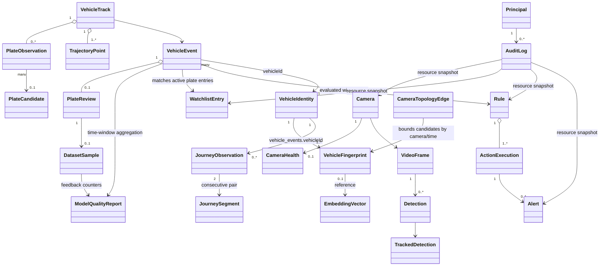

# Domain Model

## Vocabulary

- **VideoFrame**: transient frame with camera, frame number, stream epoch, UTC
  timestamp, and an in-memory image. It is never persisted to MongoDB.
- **Camera**: immutable, revisioned camera configuration. It owns sampling,
  direction, vision thresholds and geometry, but not a running decoder.
- **SecretUri**: validated `rtsp`/`rtsps` URI whose `str` and `repr` are always
  redacted. Infrastructure must opt in explicitly to reveal it at a trusted
  adapter boundary.
- **CameraHealth**: latest persisted RTSP source state and bounded counters; it
  is replaced by camera ID and is not a per-frame metric history.
- **Detection**: model-agnostic vehicle box, class, confidence, and model trace.
- **TrackedDetection**: detection associated with a camera-local tracker ID.
- **VehicleTrack**: aggregate for one continuous observation at one camera. It
  owns trajectory, type evidence, plate observations, and best-frame candidates.
- **PlateObservation**: immutable evidence from one useful plate crop. Raw OCR,
  canonical text, OCR confidence, detector confidence, and quality are retained.
- **PlateCandidate**: temporally aggregated hypothesis with evidence counts and a
  calibrated score. It is not itself a vehicle identity.
- **VehicleEvent**: versioned record emitted once when a track ends; vision
  evidence is immutable and only the explicit revisioned human-review field may
  amend its effective plate/status.
- **PlateReview**: revisioned operator decision that changes the event's effective
  plate while retaining the immutable OCR prediction.
- **DatasetSample**: bounded labeled training-feedback document referencing one
  media object and one review revision; it never owns image bytes. Its leased
  export state is `READY`, `EXPORTING`, `EXPORT_FAILED`, or `EXPORTED`.
- **ModelQualityReport**: bounded UTC-window read model containing explicit-rate
  denominators, daily points, OCR model-version slices, and dataset feedback
  state. It is derived, never persisted as event history.
- **WatchlistEntry**: revisioned association between a normalized plate and a
  business list type, bounded by optional validity dates.
- **Rule**: revisioned declarative AND-set of validated conditions and ordered
  actions; it contains no executable code.
- **ActionExecution**: durable claim/result for one event-rule-action tuple.
- **Alert**: operator-facing, revisioned snapshot produced by a rule action, with
  source execution, lifecycle actor, and timestamps.
- **Principal**: authenticated API identity with stable ID, display name, role,
  and authentication method. It is not supplied by a mutation body.
- **AuditLog**: immutable actor/action/resource record with request correlation
  and sanitized before/after snapshots.
- **RealtimeDelivery**: transient application value containing either one
  canonical `VehicleEvent` or an explicit delivery gap. It is never a second
  persisted event model.
- **VehicleFingerprint**: immutable, event-scoped identity evidence containing
  camera/time, plate signal, bounded vehicle attributes, and only a versioned
  embedding reference (never the vector itself).
- **VehicleIdentity**: revisioned logical aggregate with bounded plate aliases,
  attributes, first/last seen, and observation count. It is not equated
  automatically with either a local track ID or plate text.
- **EmbeddingVector**: separately persisted, L2-normalized visual evidence tied
  to an explicit model name/version/dimension/hash.
- **CameraTopologyEdge**: revisioned directed connection from one camera to
  another with minimum/typical/maximum travel time. Reverse travel requires a
  separate edge.
- **CrossCameraCandidate**: bounded prior fingerprint that is reachable through
  an enabled inbound edge and falls inside its travel-time window.
- **ReIDScore**: versioned, explained combination of available plate, embedding,
  type, color, and travel-time signals. It is a recommendation, not mutation.
- **IdentityReviewResult**: immutable idempotent evidence that a reviewer merged
  or split identities and how many fingerprints/events moved.
- **JourneyObservation**: chronological projection of one canonical event owned
  by a logical vehicle; it retains the source event ID.
- **JourneySegment**: derived travel interval between consecutive observations,
  optionally annotated by the exact directed topology edge and feasibility.
- **VehicleJourney**: bounded, explicitly truncatable read model; it is never an
  event-history array embedded in `VehicleIdentity`.

## Core relationships

## Important invariants

1. Bounding boxes use integer `xyxy`, have positive area, and are clipped before
   cropping.
2. Confidence and normalized quality values are in `[0, 1]`.
3. Datetimes are timezone-aware; persistent dates are UTC.
4. Logical track IDs include camera and source-session context; a reconnect epoch
   prevents reuse of a tracker-local ID from colliding with an earlier track.
5. Raw OCR is never overwritten by normalization or human review.
6. A track may produce an event with no readable plate.
7. One finalized logical track produces at most one canonical event.
8. Media fields contain object keys, never binary/base64/NumPy arrays.
9. `schemaVersion` is required for durable events and documents.
10. A dataset export ID is path-safe and immutable. A valid existing manifest is
    checksum-verified and reconciled, never overwritten; camera ID determines
    the split for every sample from that view.
11. Camera RTSP credentials are never part of public representations, process
    arguments, source IDs, or log context.
12. Camera updates increment `revision`; conflicting stale writes fail instead
    of silently overwriting newer configuration.
13. Watchlist entries always store a structurally valid normalized Vietnamese
    plate; validity timestamps are timezone-aware and form a positive interval.
14. Rule fields/operators/actions are allowlisted. Conditions use AND semantics,
    and action IDs are unique within one rule.
15. An action execution ID is deterministic for `(event, rule, action)`; a
    succeeded or terminal/exhausted execution cannot be reclaimed.
16. An alert has exactly one source action execution. `RESOLVED` is terminal;
    acknowledgement/resolution retains actor and UTC timestamp.
17. Enabled authentication has at least one active `ADMIN`; verifier hashes and
    principal IDs are unique in one configuration.
18. Authorization evaluates explicit permissions. Request bodies cannot elevate
    a principal role or choose the audit/alert actor.
19. Audit records are append-only, UTC/versioned, request-correlated, and contain
    no RTSP, Bearer, password, token, or credential material.
20. Realtime notifications retain the canonical event ID and envelope. Local
    replay and client queues are bounded; a lost range is represented as a gap,
    never silently described as complete history.
21. Human review increments an optimistic plate-review revision; stale reviewers
    cannot overwrite a newer decision.
22. `plate.prediction` remains unchanged. `plate.final` is the reviewed value
    when present and otherwise the normalized AI prediction.
23. At most one dataset sample exists for one `(sourceEventId, reviewRevision)`;
    its verified `imageKey` is a reference, not embedded media.
24. Identity bootstrap creates one deterministic logical identity per event. A
    matching plate is evidence only and never implicitly merges observations.
25. A fingerprint is unique per source event and contains no raw image/vector.
    Identity plate aliases are bounded and event history remains queryable by
    `vehicle_events.vehicleId`, never embedded in `vehicles.events[]`.
26. Vector comparison requires the same model name/version/dimension and an
    explicit bounded candidate-ID set; the vector adapter cannot collection-scan.
27. Camera topology is directed, rejects self-loops/invalid windows, and is
    unique per `(fromCameraId, toCameraId)`. Candidate generation only searches
    indexed inbound camera/time windows and applies configured per-edge/total caps.
28. ReID compares embeddings only within the same exact model identity and
    renormalizes weights over available signals. A `MATCH` verdict never mutates
    identity by itself.
29. Merge/split requires an authenticated reviewer, stable review ID, reason,
    optimistic revisions, and a bounded evidence set. The aggregate,
    fingerprints, event links, review, and audit share one transaction.
30. A timeline is ordered by `(occurredAt, eventId)`, bounded by configuration,
    and derived from canonical events. A segment uses only a matching directed
    edge; absent topology produces unknown feasibility rather than an assumption.

## Plate evidence

Normalization returns a `PlateNormalization` value containing cleaned raw text,
canonical display text, compact comparison text, structural validity, and any
position-aware corrections. Confusable characters are only changed when the
expected Vietnamese plate position admits the replacement.

Temporal voting clusters compact candidates by edit distance, weights each
observation by OCR confidence, crop quality, and plate detector confidence, then
uses character-level consensus inside the winning cluster. This preserves noisy
evidence while avoiding a single-frame final answer.

## Event status

- `CONFIRMED`: aggregate plate confidence reaches the configured confirmation
  threshold.
- `LOW_CONFIDENCE`: readable candidate exists below confirmation threshold.
- `NEEDS_REVIEW`: candidate is usable but below the review threshold.
- `NO_PLATE`: no plate detector observation was made.
- `UNREADABLE`: plates were seen but useful OCR evidence was not produced.

The thresholds are application configuration; the enum semantics are domain
concepts.

## Human review and feedback

Only events with an OCR plate prediction can enter the current correction flow.
A review may confirm the AI value or supply another structurally valid Vietnamese
plate. Both outcomes set the event status to `CONFIRMED`, retain reviewer/time/
note evidence, and preserve the original raw/normalized/confidence fields.

Dataset reasons distinguish `HUMAN_CONFIRMATION` from `HUMAN_CORRECTION`.
Samples enter `READY` state and reference the OCR model metadata captured by the
source event. Export lifecycle remains outside the review request. The exporter
leases work through `EXPORTING`, records `EXPORT_FAILED` for recoverable sample
errors, and reaches `EXPORTED` only after artifact verification. The retention
worker treats `READY`, `EXPORTING`, and `EXPORT_FAILED` sample media and source
events as explicit pins.

## Policy vocabulary

Watchlist types are `WHITELIST`, `BLACKLIST`, `VIP`, `STAFF`, `CONTRACTOR`, and
`DELIVERY`. An event with no plate simply has no watchlist context and may still
match rules on camera, direction, status, or vehicle attributes.

Rule priority determines evaluation order, not conflict resolution. Every
matched action is considered; durable action IDs provide replay safety. Action
status is `RUNNING`, `SUCCEEDED`, or `FAILED`. Alert status is `OPEN`,
`ACKNOWLEDGED`, or `RESOLVED`, with severities from `INFO` through `CRITICAL`.

Watchlist, rule, and alert updates use optimistic `revision` values. This is an
application/domain concurrency invariant independent of MongoDB's driver API.
